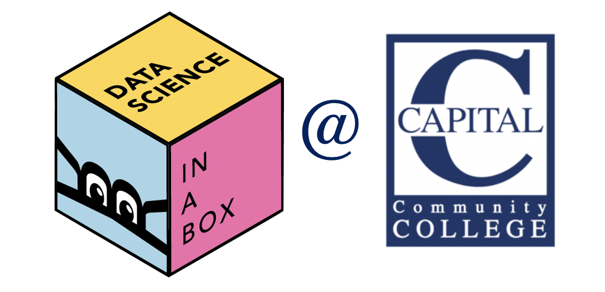

# Welcome to DTS 201 {.unnumbered}

 Welcome to the website for the <b>Data Science in R</b> at Capital Community College!

This website hosts the supplementary course videos (and the slide decks used in the videos) as well as information on access to computational resources for the courses.

## License {.unnumbered}

 This online work is licensed under a <a rel="license" href="https://creativecommons.org/licenses/by-sa/4.0/">Creative Commons Attribution-ShareAlike 4.0 International</a>.
Visit [here](https://github.com/dukestatsciintrods/blob/master/LICENSE.md) for more information about the license.

## Acknowledgements {.unnumbered}

Much of these materials have been adapted from [Data Science in a Box](https://datasciencebox.org/), by Mine Çetinkaya-Rundel under the Creative Commons Attribution Share Alike 4.0 International.
